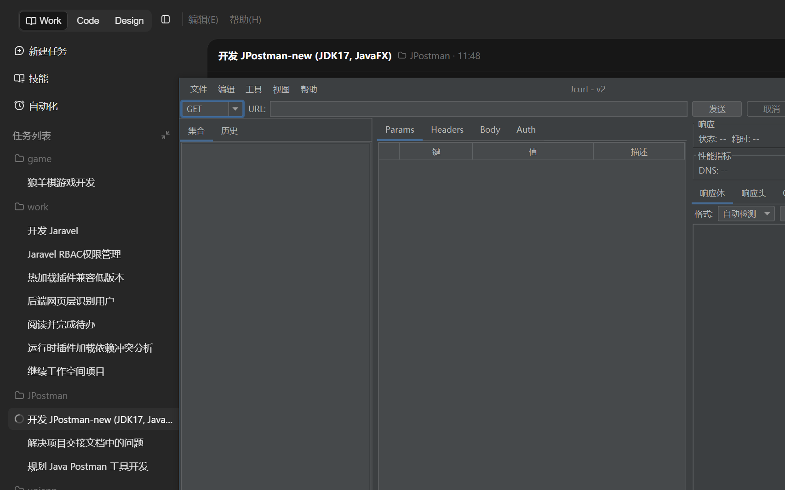
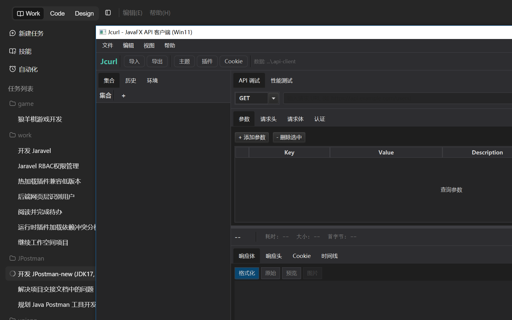

<div align="center">

# Jcurl

**A lightweight, cross-platform HTTP API client with CLI, JavaFX GUI, and Swing GUI**

**轻量级跨平台 HTTP API 客户端 — 支持 CLI 命令行、JavaFX 图形界面、Swing 图形界面**

[](https://openjdk.org/)
[](https://spring.io/projects/spring-boot)
[](https://openjfx.io/)
[](LICENSE)

</div>

---

## English | [中文](#中文)

## English

### Overview

Jcurl is a desktop HTTP API client inspired by Postman, with a curl-compatible CLI mode. It is built as a multi-module Maven project:

| Module | Description | Tech Stack |
|--------|-------------|------------|
| `jcurl-plugin-api` | Shared plugin API (JDK 8) | JDK 8, Jackson annotations |
| `jcurl-core` | Core backend + CLI | SpringBoot 3.2, JDK 17, OkHttp, Jackson |
| `jcurl-javafx` | Modern GUI (Win11+) | JavaFX 21, RichTextFX, Win11 Fluent design |
| `jcurl-swing` | Legacy GUI (Win7+) | Swing, FlatLaf, SpringBoot 2.7, JDK 8 |
| `jcurl-plugin-demo` | Demo JAR plugin | JDK 8 |

> **Plugin compatibility**: Plugins are identical across all versions (Swing/JavaFX/CLI). One `.java` or `.jar` plugin file works everywhere without modification.

### Features

- **curl-compatible CLI** — 30+ curl options (`-X`, `-H`, `-d`, `-F`, `-u`, `-b`, `-o`, `-i`, `-s`, `-v`, `-w`, `-L`, etc.)
- **Dual GUI** — JavaFX (modern) + Swing (legacy Win7-compatible)
- **Syntax highlighting** — JSON / XML / HTML via RichTextFX
- **Cookie management** — Per-collection cookie isolation, auto Set-Cookie parsing
- **Environment variables** — `{{variable}}` with auto-completion, built-in `$timestamp`, `$uuid`, `$randomInt`
- **Plugin system** — Java source plugins compiled at runtime, 4 extension points
- **Performance testing** — Concurrent requests, percentile stats (p50/p90/p99)
- **Collection management** — Drag-and-drop reordering, import/export (Postman v2.1, OpenAPI 3.0, cURL)
- **Auto headers** — 6 default headers with per-header checkbox disable

### Screenshots

**Swing GUI (Win7-compatible, FlatLaf dark theme):**



**JavaFX GUI (Modern, Win11 Fluent style):**



### Build from Source

#### Prerequisites

- **JDK 17+** required for building all modules (JDK 8 modules are compiled with `--release 8`)
- **Maven 3.6+**
- Set `JAVA_HOME` to your JDK 17+ installation directory

#### Steps

```bash
# 1. Clone the repository
git clone https://github.com/weacsoft/Jcurl.git
cd Jcurl

# 2. Build all modules (skip tests for faster build)
mvn clean package -DskipTests

# 3. Verify build output — JAR files are generated in each module's target/ directory:
#    jcurl-core/target/jcurl-core-0.1.0-SNAPSHOT-exec.jar     (CLI)
#    jcurl-javafx/target/jcurl-javafx-0.1.0-SNAPSHOT.jar       (JavaFX GUI)
#    jcurl-swing/target/jcurl-swing-0.1.0-SNAPSHOT.jar         (Swing GUI)
#    jcurl-plugin-demo/target/jcurl-plugin-demo-0.1.0-SNAPSHOT.jar  (Demo JAR plugin)
```

> **Note**: The build uses JDK 17+ to compile all modules. The `jcurl-plugin-api` and `jcurl-swing` modules are compiled with `--release 8` to ensure JDK 8 runtime compatibility. The `jcurl-core` and `jcurl-javafx` modules require JDK 17+ at runtime.

> **Tip**: If you only need the Swing version and have JDK 8, you can build individual modules: `mvn clean package -DskipTests -pl jcurl-plugin-api,jcurl-swing -am`

### Quick Start

```bash
# CLI mode (curl-compatible) — requires JDK 17+
java --add-modules jdk.compiler -jar jcurl-core/target/jcurl-core-0.1.0-SNAPSHOT-exec.jar https://httpbin.org/get

# JavaFX GUI — requires JDK 17+
java --add-modules jdk.compiler -jar jcurl-javafx/target/jcurl-javafx-0.1.0-SNAPSHOT.jar

# Swing GUI — requires JDK 8+ (use JDK for .java plugin compilation)
java -jar jcurl-swing/target/jcurl-swing-0.1.0-SNAPSHOT.jar
# Or with JDK for plugin compilation support:
java --add-modules jdk.compiler -jar jcurl-swing/target/jcurl-swing-0.1.0-SNAPSHOT.jar
```

Or use the launch scripts (auto-detects JDK and `--add-modules`):
```bash
run-jcurl-cli.bat    -i https://httpbin.org/get
run-jcurl-javafx.bat
run-jcurl-swing.bat
```

### CLI Examples

```bash
# GET with response headers
java -jar jcurl-core.jar -i https://httpbin.org/get

# POST JSON
java -jar jcurl-core.jar -X POST -d '{"key":"value"}' -H "Content-Type: application/json" https://httpbin.org/post

# Basic auth
java -jar jcurl-core.jar -u user:pass https://httpbin.org/basic-auth/user/pass

# Custom output format
java -jar jcurl-core.jar -s -o response.json -w "%{http_code} %{time_total}s\n" https://httpbin.org/get

# Multipart form upload
java -jar jcurl-core.jar -F "file=@photo.jpg" -F "name=hello" https://httpbin.org/post
```

### Plugin Development

Create a `.java` file implementing any of the 4 extension points:

```java
@JcurlPlugin(name = "My Plugin", version = "1.0.0")
public class MyPlugin implements RequestInterceptor, ResponseInterceptor,
        VariableFunctionExtension, MetricsCollectorExtension {

    @Override
    public RequestConfig beforeRequest(RequestConfig config, PluginContext ctx) {
        ctx.log("info", "Sending: " + config.getUrl());
        return config;
    }
    // ... implement other extension points
}
```

Install via the Plugin Manager dialog or copy to `./.api-client/plugins/`.

See [DemoPlugin.java](plugins/DemoPlugin.java) for a complete example.

### Project Structure

```
jcurl/
├── pom.xml                  # Parent POM (aggregates 5 modules)
├── jcurl-plugin-api/        # Shared plugin API (JDK 8)
│   └── src/main/java/com/jcurl2/
│       ├── model/           # Header, RequestConfig, ResponseData, TimingMetrics
│       └── plugin/          # ExtensionPoint, JcurlPlugin, PluginContext, 4 extension interfaces
├── jcurl-core/              # Core + CLI
│   └── src/main/java/com/jcurl2/
│       ├── cli/             # CurlArgParser, CliLauncher
│       ├── config/          # AppConfig
│       ├── model/           # DTOs, components
│       ├── plugin/          # PluginManager, JavaSourceCompiler, PluginService
│       ├── service/         # HttpEngineService, CookieService, etc.
│       └── store/           # JSON file storage
├── jcurl-javafx/            # JavaFX GUI
│   └── src/main/java/com/jcurl2/ui/
├── jcurl-swing/             # Swing GUI (pure UI layer, no functional difference)
│   └── src/main/java/com/jcurl/
├── jcurl-plugin-demo/       # Demo JAR plugin
├── plugins/                 # Demo source plugin
└── run-jcurl-*.bat          # Launch scripts
```

### Requirements

- **Build**: JDK 17+ and Maven 3.6+
- **CLI + JavaFX runtime**: JDK 17+
- **Swing runtime**: JDK 8+ (Win7 compatible)
- **Plugin compilation**: JDK required (JRE cannot compile `.java` plugins; `.jar` plugins work in JRE)

### License

MIT


---

## 中文

### 项目简介

Jcurl 是一个受 Postman 启发的桌面 HTTP API 客户端，同时提供 curl 兼容的命令行模式。采用多模块 Maven 架构：

| 模块 | 说明 | 技术栈 |
|------|------|--------|
| `jcurl-plugin-api` | 共享插件 API (JDK 8) | JDK 8, Jackson annotations |
| `jcurl-core` | 核心后端 + CLI 命令行 | SpringBoot 3.2, JDK 17, OkHttp, Jackson |
| `jcurl-javafx` | 新版图形界面 (Win11+) | JavaFX 21, RichTextFX, Win11 Fluent 风格 |
| `jcurl-swing` | 旧版图形界面 (Win7+) | Swing, FlatLaf, SpringBoot 2.7, JDK 8 |
| `jcurl-plugin-demo` | JAR 插件示例 | JDK 8 |

> **插件兼容性**：插件在所有版本（Swing/JavaFX/CLI）中完全一致，同一个 `.java` 或 `.jar` 插件文件无需任何修改即可在所有版本运行。

### 功能特性

- **curl 兼容 CLI** — 支持 30+ curl 选项（`-X`、`-H`、`-d`、`-F`、`-u`、`-b`、`-o`、`-i`、`-s`、`-v`、`-w`、`-L` 等）
- **双图形界面** — JavaFX（现代版）+ Swing（旧版 Win7 兼容）
- **语法高亮** — RichTextFX 实现 JSON / XML / HTML 语法高亮
- **Cookie 管理** — 按集合隔离，自动解析 Set-Cookie 并在后续请求中携带
- **环境变量** — `{{variable}}` 自动补全，内置 `$timestamp`、`$uuid`、`$randomInt` 动态函数
- **插件系统** — 运行时编译 Java 源码插件，支持 4 大扩展点
- **性能测试** — 并发请求，百分位统计（p50/p90/p99）
- **集合管理** — 拖拽排序，支持导入/导出（Postman v2.1、OpenAPI 3.0、cURL）
- **自动请求头** — 6 个默认头自动合并，每个头可单独 CheckBox 取消

### 运行截图

**Swing 图形界面（Win7 兼容, FlatLaf 暗色主题）：**


**JavaFX 图形界面（现代版, Win11 Fluent 风格）：**


### 从源码编译

#### 前置条件

- **JDK 17+**（用于编译所有模块，JDK 8 模块使用 `--release 8` 交叉编译）
- **Maven 3.6+**
- 设置 `JAVA_HOME` 指向 JDK 17+ 安装目录

#### 编译步骤

```bash
# 1. 克隆仓库
git clone https://github.com/weacsoft/Jcurl.git
cd Jcurl

# 2. 编译所有模块（跳过测试以加快速度）
mvn clean package -DskipTests

# 3. 验证编译产物 — JAR 文件生成在各模块的 target/ 目录下：
#    jcurl-core/target/jcurl-core-0.1.0-SNAPSHOT-exec.jar       (CLI 命令行)
#    jcurl-javafx/target/jcurl-javafx-0.1.0-SNAPSHOT.jar         (JavaFX 图形界面)
#    jcurl-swing/target/jcurl-swing-0.1.0-SNAPSHOT.jar           (Swing 图形界面)
#    jcurl-plugin-demo/target/jcurl-plugin-demo-0.1.0-SNAPSHOT.jar  (JAR 插件示例)
```

> **说明**：编译需要 JDK 17+，`jcurl-plugin-api` 和 `jcurl-swing` 模块使用 `--release 8` 编译以确保 JDK 8 运行时兼容。`jcurl-core` 和 `jcurl-javafx` 模块运行时需要 JDK 17+。

> **提示**：如果只需要 Swing 版本且只有 JDK 8，可以单独编译：`mvn clean package -DskipTests -pl jcurl-plugin-api,jcurl-swing -am`

### 快速开始

```bash
# CLI 模式 (curl 兼容) — 需要 JDK 17+
java --add-modules jdk.compiler -jar jcurl-core/target/jcurl-core-0.1.0-SNAPSHOT-exec.jar https://httpbin.org/get

# JavaFX 图形界面 — 需要 JDK 17+
java --add-modules jdk.compiler -jar jcurl-javafx/target/jcurl-javafx-0.1.0-SNAPSHOT.jar

# Swing 图形界面 — 需要 JDK 8+（使用 JDK 可获得 .java 插件编译能力）
java -jar jcurl-swing/target/jcurl-swing-0.1.0-SNAPSHOT.jar
# 或使用 JDK 以支持插件编译：
java --add-modules jdk.compiler -jar jcurl-swing/target/jcurl-swing-0.1.0-SNAPSHOT.jar
```

或使用启动脚本（自动检测 JDK 和 `--add-modules`）：
```bash
run-jcurl-cli.bat    -i https://httpbin.org/get
run-jcurl-javafx.bat
run-jcurl-swing.bat
```

### CLI 示例

```bash
# GET 请求并显示响应头
java -jar jcurl-core.jar -i https://httpbin.org/get

# POST JSON
java -jar jcurl-core.jar -X POST -d '{"key":"value"}' -H "Content-Type: application/json" https://httpbin.org/post

# Basic 认证
java -jar jcurl-core.jar -u user:pass https://httpbin.org/basic-auth/user/pass

# 自定义输出格式
java -jar jcurl-core.jar -s -o response.json -w "%{http_code} %{time_total}s\n" https://httpbin.org/get

# Multipart 表单上传
java -jar jcurl-core.jar -F "file=@photo.jpg" -F "name=hello" https://httpbin.org/post
```

### 插件开发

创建一个 `.java` 文件，实现 4 大扩展点中的任意一个：

```java
@JcurlPlugin(name = "我的插件", version = "1.0.0")
public class MyPlugin implements RequestInterceptor, ResponseInterceptor,
        VariableFunctionExtension, MetricsCollectorExtension {

    @Override
    public RequestConfig beforeRequest(RequestConfig config, PluginContext ctx) {
        ctx.log("info", "发送请求: " + config.getUrl());
        return config;
    }
    // ... 实现其他扩展点
}
```

通过插件管理对话框安装，或复制到 `./.api-client/plugins/` 目录。

完整示例见 [DemoPlugin.java](plugins/DemoPlugin.java)。

### 环境要求

- **编译**：JDK 17+ 和 Maven 3.6+
- **CLI + JavaFX 运行**：JDK 17+
- **Swing 运行**：JDK 8+（兼容 Win7）
- **插件编译**：需要 JDK 环境（JRE 无法编译 `.java` 插件，但 `.jar` 插件可在 JRE 中运行）

### 开源协议

MIT
